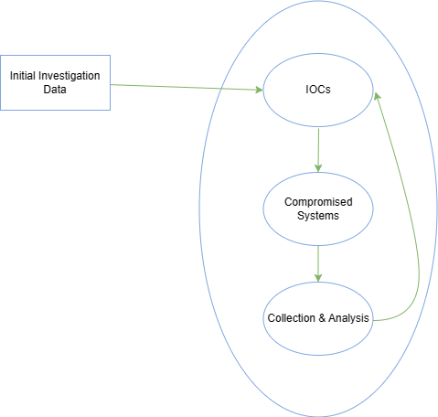

# Detection & Analysis Stage (Part 2)

Cuando se inicia una investigación, nuestro objetivo es comprender qué y cómo sucedió. Para analizar los datos relacionados con incidentes de manera adecuada y eficiente, los miembros del equipo de manejo de incidentes necesitan un profundo conocimiento técnico y experiencia en el campo. Uno podría preguntarse: "¿Por qué nos importa cómo ocurrió un incidente? ¿Por qué no simplemente reconstruimos los sistemas afectados y básicamente nos olvidamos de lo que sucedió?".

Si no sabemos cómo ocurrió un incidente o qué se vio afectado, cualquier medida correctiva que tomemos no garantizará que el atacante no pueda repetir sus acciones para recuperar el acceso. Si, por otro lado, sabemos exactamente cómo entró el adversario, qué herramientas utilizó y qué sistemas se vieron afectados, entonces podemos planificar nuestra remediación para garantizar que esta ruta de ataque no pueda replicarse.

---

# **La investigación**

La investigación comienza con base en la información inicialmente recopilada (y limitada) que contiene lo que sabemos sobre el incidente hasta el momento. Con estos datos iniciales, comenzaremos un proceso cíclico de 3 pasos que se repetirá una y otra vez a medida que evolucione la investigación. Este proceso incluye:

- Creación y uso de indicadores de compromiso (IOC)
- Identificación de nuevos clientes potenciales y sistemas impactados.
- Recopilación y análisis de datos de los nuevos clientes potenciales y sistemas impactados.

Profundicemos ahora en el proceso descrito anteriormente.

---

### **Datos de la investigación inicial**

Para llegar a una conclusión, una investigación debe basarse en pistas válidas que se hayan descubierto no sólo durante esta fase inicial sino a lo largo de todo el proceso de investigación. El equipo de manejo de incidentes debe generar nuevas pistas constantemente y no buscar únicamente un hallazgo específico, como una herramienta maliciosa conocida. Limitar una investigación a una actividad específica a menudo da como resultado hallazgos limitados, conclusiones prematuras y una comprensión incompleta del impacto general.

---

### **Creación y uso de COI**

Un indicador de compromiso es una señal de que ha ocurrido un incidente. Las IOC están documentadas de manera estructurada, lo que representa los artefactos del compromiso. Ejemplos de IOC pueden ser direcciones IP, valores hash de archivos y nombres de archivos. De hecho, debido a que los IOC son tan importantes para una investigación, se han desarrollado lenguajes especiales como OpenIOC para documentarlos y compartirlos de manera estándar. Otro estándar ampliamente utilizado para los COI es Yara. Hay una serie de herramientas gratuitas que se pueden utilizar, como el Editor de COI de Mandiant, para crear o editar COI. Usando estos lenguajes, podemos describir y usar los artefactos que descubrimos durante la investigación de un incidente. Incluso podremos obtener COI de terceros si se conoce el adversario o el ataque.

Para aprovechar las COI, tendremos que implementar una herramienta de obtención/búsqueda de COI (nativa o de terceros y posiblemente a escala). Un enfoque común es utilizar WMI o PowerShell para operaciones relacionadas con IOC en entornos Windows. ¡Una palabra de precaución! Durante una investigación, debemos tener mucho cuidado para evitar que las credenciales de nuestros usuarios altamente privilegiados se almacenen en caché cuando nos conectamos a sistemas (potencialmente) comprometidos (o a cualquier sistema, en realidad). Más específicamente, debemos asegurarnos de que solo se utilicen protocolos de conexión y herramientas que no almacenen en caché las credenciales tras un inicio de sesión exitoso (como WinRM). Los inicios de sesión de Windows con tipo de inicio de sesión 3 (inicio de sesión de red) normalmente no almacenan en caché las credenciales en los sistemas remotos. El mejor ejemplo de "conozca sus herramientas" que me viene a la mente es "PsExec". Cuando se utiliza "PsExec" con credenciales explícitas, esas credenciales se almacenan en caché en la máquina remota. Cuando se utiliza "PsExec" sin credenciales a través de la sesión del usuario que ha iniciado sesión actualmente, las credenciales no se almacenan en caché en la máquina remota. Este es un gran ejemplo de cómo la misma herramienta deja diferentes huellas, así que tenga cuidado.

---

### **Identificación de nuevos clientes potenciales y sistemas afectados**

Después de buscar IOC, espera obtener algunos resultados que revelen otros sistemas con los mismos signos de compromiso. Es posible que estos resultados no estén directamente asociados con el incidente que estamos investigando. Nuestro COI podría ser, por ejemplo, demasiado genérico. Necesitamos identificar y eliminar los falsos positivos. También podemos acabar en una posición en la que nos encontremos con un gran número de aciertos. En este caso, debemos priorizar aquellos en los que nos centraremos, idealmente aquellos que puedan proporcionarnos nuevas pistas tras un potencial análisis forense.

---

### **Recopilación y análisis de datos de los nuevos clientes potenciales y sistemas impactados**

Una vez que hayamos identificado los sistemas que incluyeron nuestros IOC, querremos recopilar y preservar el estado de esos sistemas para realizar análisis adicionales con el fin de descubrir nuevas pistas y/o responder preguntas de investigación sobre el incidente. Dependiendo del sistema, existen múltiples enfoques sobre cómo y qué datos recopilar. A veces queremos realizar una "respuesta en vivo" en un sistema mientras se está ejecutando, mientras que en otros casos es posible que deseemos apagar un sistema y luego realizar cualquier análisis en él. La respuesta en vivo es el enfoque más común, donde recopilamos un conjunto predefinido de datos que suele ser rico en artefactos que pueden explicar lo que le sucedió a un sistema. Apagar un sistema no es una decisión fácil cuando se trata de preservar información valiosa porque, en muchos casos, muchos de los artefactos solo vivirán dentro de la memoria RAM de la máquina, que se perderá si se apaga la máquina. Independientemente del enfoque de recopilación que elijamos, es vital garantizar que se produzca una interacción mínima con el sistema para evitar alterar cualquier evidencia o artefacto.

Una vez recopilados los datos, llega el momento de analizarlos. Este suele ser el proceso que lleva más tiempo durante un incidente. El análisis de malware y el análisis forense de discos son los tipos de examen más comunes. Cualquier cliente potencial recién descubierto y validado se agrega a la línea de tiempo, que se actualiza constantemente. Tenga en cuenta también que el análisis forense de la memoria es una capacidad que se está volviendo cada vez más popular y es extremadamente relevante cuando se trata de ataques avanzados.

Tenga en cuenta que durante el proceso de recopilación de datos, debe realizar un seguimiento de la cadena de custodia para garantizar que los datos examinados sean admisibles ante un tribunal si se van a emprender acciones legales contra un adversario.