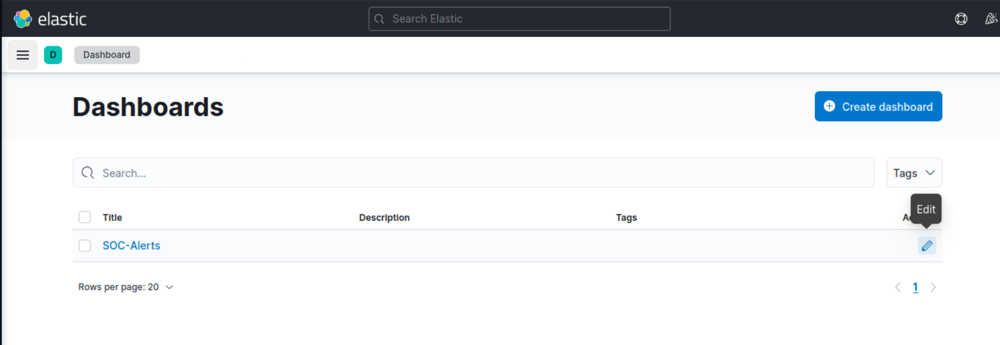
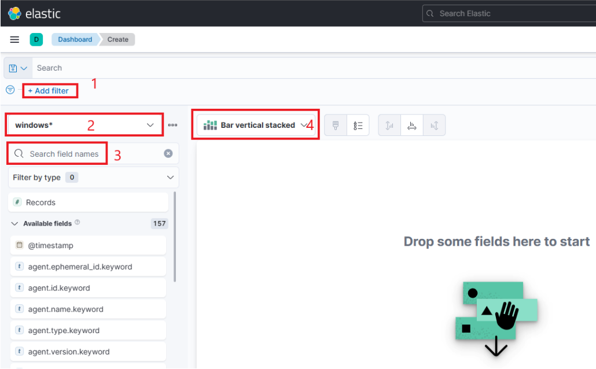
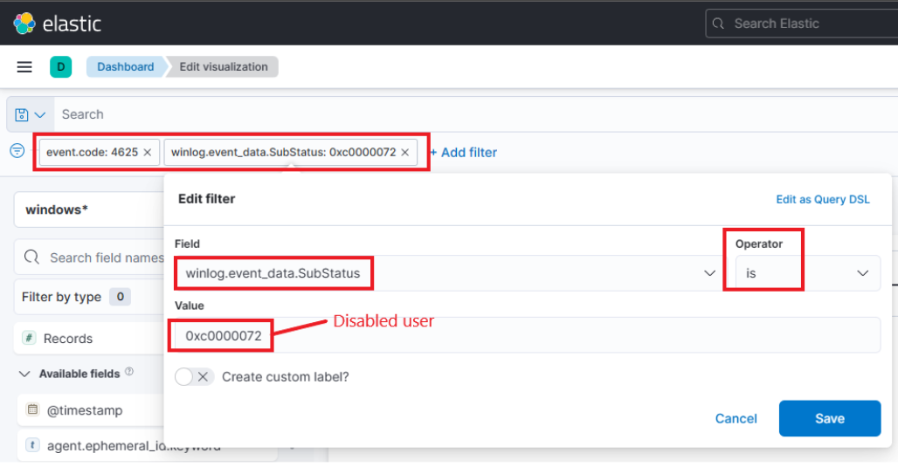
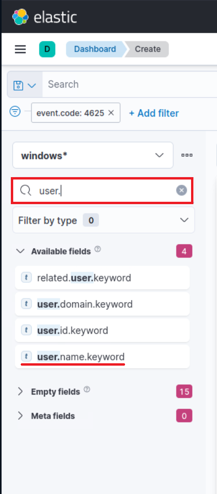
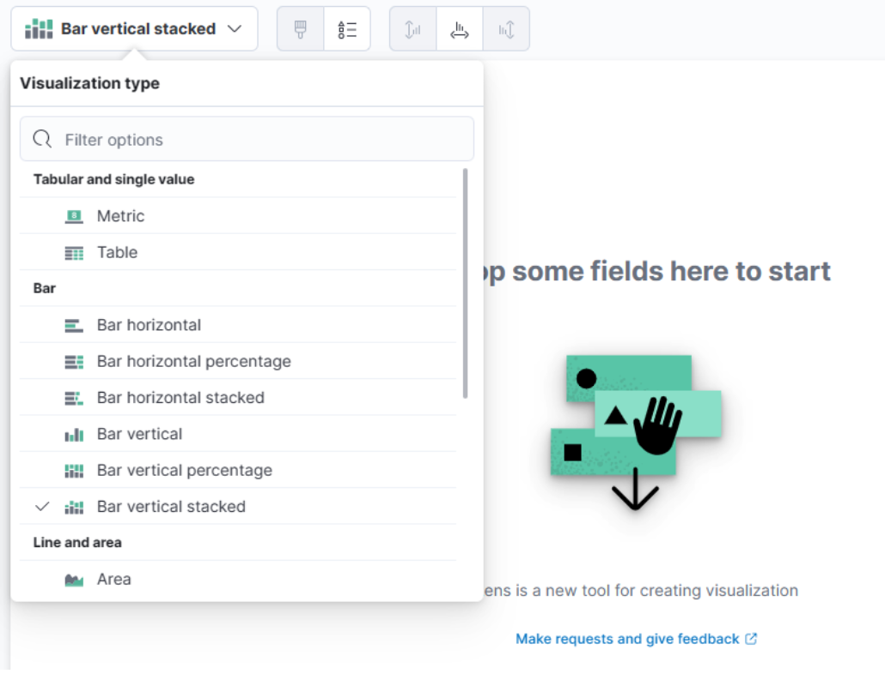
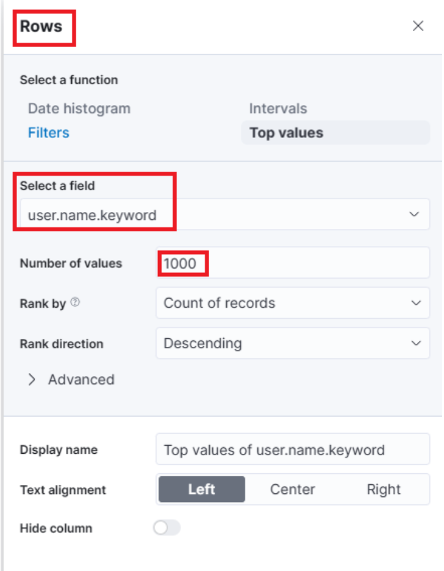
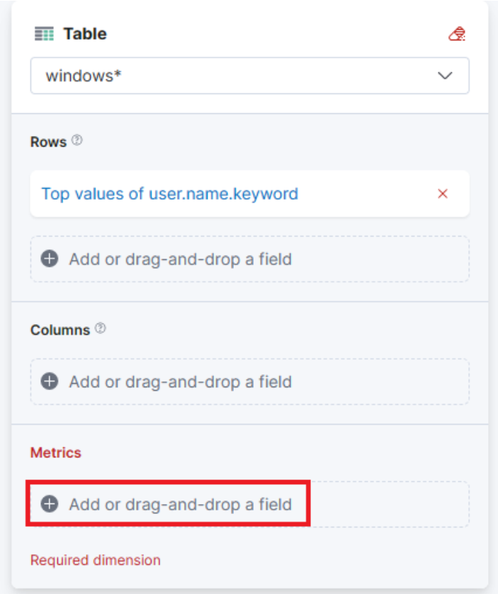
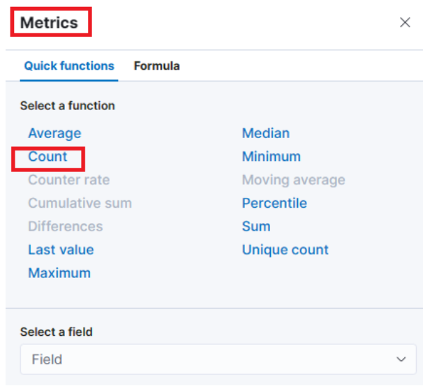

# SIEM Visualization Example 2: Failed Logon Attempts (Disabled Users)

En este ejemplo de visualización SIEM queremos crear una visualización para monitorear los intentos fallidos de inicio de sesión contra usuarios discapacitados.

Mencionamos "fallido" porque no es posible iniciar sesión con un usuario deshabilitado, por lo que nunca será exitoso incluso si se proporcionan las credenciales correctas. En un escenario donde se proporcionan las credenciales correctas, los registros de Windows contendrán un valor de SubStatus adicional de 0xC0000072, que indica el motivo del error.

Navegue hasta el final de esta sección y haga clic en `Click here to spawn the target system!`.

Navegar a `http://[Target IP]:5601`, haga clic en el botón de navegación lateral y haga clic en "Panel de control".

Debe quedar visible un tablero precocido. Hagamos clic en el icono "lápiz"/editar.

Ahora, para iniciar la creación de nuestra primera visualización, simplemente debemos hacer clic en el botón "Crear visualización".

Al iniciar la creación de nuestra primera visualización, aparecerá la siguiente nueva ventana con varias opciones y configuraciones.

Hay cuatro cosas que debemos notar en esta ventana:

1. Una opción de filtro que nos permite filtrar los datos antes de crear un gráfico. En este caso, nuestro objetivo es mostrar los intentos fallidos de inicio de sesión únicamente para usuarios discapacitados. Podemos usar un filtro para considerar solo los ID de eventos que coincidan`4625 – Failed logon attempt on a Windows system`, como hicimos en el ejemplo de visualización anterior. Sin embargo, en este caso también deberíamos tener en cuenta el SubStatus (`winlog.event_data.SubStatus`campo) que indica, cuando se establece en 0xC0000072, que el error se debe a un inicio de sesión con un usuario deshabilitado. La siguiente imagen muestra cómo podemos especificar dicho filtro.
    
    
    
2. Este campo indica el conjunto de datos (índice) que vamos a utilizar. Es común que los datos de varias fuentes de infraestructura se separen en diferentes índices, como red, Windows, Linux, etc. En este ejemplo en particular, especificaremos`windows*`en el "Patrón de índice".
3. Esta barra de búsqueda nos brinda la capacidad de verificar dos veces la existencia de un campo específico dentro de nuestro conjunto de datos, lo que sirve como otra forma de asegurarnos de que estamos viendo los datos correctos. Al igual que en la visualización anterior, nos interesa la`user.name.keyword`campo. Podemos usar la barra de búsqueda para realizar una búsqueda rápidamente y verificar si este campo está presente y descubierto dentro de nuestro conjunto de datos seleccionado. Esto nos permite confirmar que estamos accediendo al campo deseado y trabajando con datos precisos.
    
    
    
4. Por último, este menú desplegable nos permite seleccionar el tipo de visualización que queremos crear. La opción predeterminada que se muestra en la imagen anterior es "Barra vertical apilada". Si hacemos clic en ese botón, se revelarán opciones adicionales disponibles (imagen redactada porque no todas las opciones caben en la pantalla). De esta lista ampliada podremos elegir el tipo de visualización deseada que mejor se adapte a nuestros requerimientos y necesidades de presentación de datos.
    
    
    

---

Para esta visualización, seleccionemos la opción "Tabla". Luego de seleccionar la “Tabla”, podemos proceder a hacer clic en la opción “Filas”. Esto nos permitirá elegir los elementos de datos específicos que queremos incluir en la vista de tabla.

Configuremos los ajustes de "Filas" de la siguiente manera.

Avanzando, cerremos la ventana "Filas" y procedamos a ingresar a la configuración de "Métricas".

En la ventana "Métricas", seleccionemos "contar" como la métrica deseada.

Una última adición a la tabla es incluir otra configuración de "Filas" para mostrar la máquina donde ocurrió el intento fallido de inicio de sesión. Para ello seleccionaremos el`host.hostname.keyword`, que representa la computadora que informa el intento fallido de inicio de sesión. Esto nos permitirá mostrar el nombre del host o el nombre de la máquina junto con el recuento de intentos fallidos de inicio de sesión, como se muestra en la imagen.

Ahora podemos ver tres columnas en la tabla, que contienen la siguiente información:

1. El usuario deshabilitado cuyas credenciales generaron el evento de intento fallido de inicio de sesión.
2. La máquina en la que se produjo el intento de inicio de sesión.
3. La cantidad de veces que ocurrió el evento (según el período de tiempo especificado o el conjunto de datos completo, según la configuración).

Finalmente, haz clic en "Guardar y regresar", y observarás que la nueva visualización se agrega al tablero.

Espere entre 3 y 5 minutos para que Kibana esté disponible después de generar el objetivo de las preguntas a continuación.