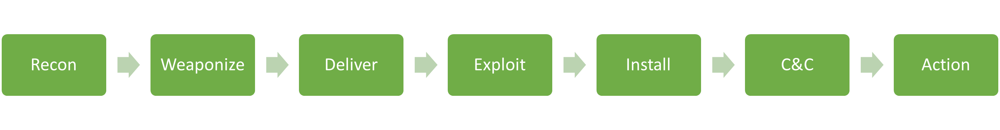

# Cadena de matar cibernética
# **¿Qué es la cadena de muerte cibernética?**

Antes de comenzar a hablar sobre el manejo de incidentes, debemos comprender el ciclo de vida del ataque (también conocido como la cadena de ciberataque). Este ciclo de vida describe cómo se manifiestan los ataques. Comprender este ciclo de vida nos proporcionará información valiosa sobre qué tan lejos en la red se encuentra un atacante y a qué puede tener acceso durante la fase de investigación de un incidente.

La cadena de ciberataque consta de siete (7) etapas diferentes, como se muestra en la siguiente imagen:

El `recon` La etapa es la etapa inicial e implica la parte en la que un atacante elige su objetivo. Además, el atacante luego recopila información para familiarizarse con el objetivo y recopila la mayor cantidad de datos útiles posible, que pueden usarse no solo en esta etapa sino también en otras etapas de esta cadena. Algunos atacantes prefieren realizar una recopilación pasiva de información de fuentes web como LinkedIn e Instagram, pero también de la documentación de las páginas web de la organización objetivo. Los anuncios de empleo y las empresas asociadas a menudo revelan información sobre la tecnología utilizada en la organización objetivo. Pueden proporcionar información extremadamente específica sobre herramientas antivirus, sistemas operativos y tecnologías de redes. Otros atacantes van un paso más allá; comienzan a 'hurgar' y escanean activamente aplicaciones web externas y direcciones IP que pertenecen a la organización de destino.

En el `weaponize` En esta etapa, el malware que se utilizará para el acceso inicial se desarrolla y se integra en algún tipo de exploit o carga útil entregable. Este malware está diseñado para ser extremadamente liviano e indetectable por el antivirus y las herramientas de detección. Es probable que el atacante haya recopilado información para identificar el antivirus o la tecnología EDR actual en la organización objetivo. A gran escala, el único propósito de esta etapa inicial es proporcionar acceso remoto a una máquina comprometida en el entorno de destino, que también tiene la capacidad de persistir mediante reinicios de la máquina y la capacidad de implementar herramientas y funcionalidades adicionales a pedido.

En el `delivery` etapa, el exploit o la carga útil se entrega a la(s) víctima(s). Los enfoques tradicionales son correos electrónicos de phishing que contienen un archivo adjunto malicioso o un enlace a una página web. La página web puede tener dos funciones: contener un exploit o alojar la carga maliciosa para evitar enviarla a través de herramientas de escaneo de correo electrónico. Para ser justos, la página web también puede imitar un sitio web legítimo utilizado por la organización objetivo en un intento de engañar a la víctima para que ingrese sus credenciales y las recopile. Algunos atacantes llaman a la víctima por teléfono con un pretexto de ingeniería social en un intento de convencerla de que ejecute la carga útil. La carga útil en estos casos de obtención de confianza se aloja en un sitio web controlado por el atacante que imita un sitio web conocido por la víctima (por ejemplo, una copia del sitio web de la organización objetivo). Es extremadamente raro entregar una carga útil que requiera que la víctima haga más que hacer doble clic en un archivo ejecutable o un script (en entornos Windows, esto puede ser .bat, .cmd, .vbs, .js, .hta y otros formatos). ). Finalmente, hay casos en los que se utiliza la interacción física para entregar la carga útil a través de tokens USB y herramientas de almacenamiento similares, que se dejan intencionalmente.

El `exploitation` La etapa es el momento en el que se activa un exploit o una carga útil entregada. Durante la etapa de explotación de la cadena de ciberataque, el atacante normalmente intenta ejecutar código en el sistema objetivo para obtener acceso o control.

En el `installation` etapa, el stager inicial se ejecuta y se ejecuta en la máquina comprometida. Como ya se mencionó, la etapa de instalación se puede llevar a cabo de varias maneras, dependiendo de los objetivos del atacante y la naturaleza del compromiso. Algunas técnicas comunes utilizadas en la etapa de instalación incluyen:

- **goteros**: Los atacantes pueden utilizar droppers para enviar malware al sistema de destino. Un dropper es un pequeño fragmento de código diseñado para instalar malware en el sistema y ejecutarlo. El dropper puede entregarse a través de diversos medios, como archivos adjuntos de correo electrónico, sitios web maliciosos o tácticas de ingeniería social.
- **puertas traseras**: Una puerta trasera es un tipo de malware diseñado para proporcionar al atacante acceso continuo al sistema comprometido. La puerta trasera puede ser instalada por el atacante durante la etapa de explotación o entregada a través de un gotero. Una vez instalada, la puerta trasera se puede utilizar para ejecutar más ataques o robar datos del sistema comprometido.
- **rootkits**: Un rootkit es un tipo de malware diseñado para ocultar su presencia en un sistema comprometido. Los rootkits se utilizan a menudo en la etapa de instalación para evadir la detección por parte del software antivirus y otras herramientas de seguridad. El atacante puede instalar el rootkit durante la etapa de explotación o entregarlo a través de un gotero.

En el `command and control` En esta etapa, el atacante establece una capacidad de acceso remoto a la máquina comprometida. Como se mencionó, no es raro utilizar un escenario inicial modular que carga scripts adicionales "sobre la marcha". Sin embargo, los grupos avanzados utilizarán herramientas independientes para garantizar que múltiples variantes de su malware vivan en una red comprometida y, si una de ellas es descubierta y contenida, aún tendrán los medios para regresar al entorno.

La etapa final de la cadena es la `action` u objetivo del ataque. El objetivo de cada ataque puede variar. Algunos adversarios pueden intentar extraer datos confidenciales, mientras que otros pueden querer obtener el mayor nivel de acceso posible dentro de una red para implementar ransomware. El ransomware es un tipo de malware que inutilizará o hará que todos los datos almacenados en los dispositivos y servidores finales sean inutilizables o inaccesibles a menos que se pague un rescate dentro de un período de tiempo limitado (no recomendado).

Es importante comprender que los adversarios no operarán de manera lineal (como muestra la cadena de ciberataque). Algunas etapas anteriores de la cibercadena se repetirán una y otra vez. Si tomamos, por ejemplo, el`installation`etapa de un compromiso exitoso, el siguiente paso lógico para un adversario en el futuro es iniciar la`recon`etapa nuevamente para identificar objetivos adicionales y encontrar vulnerabilidades para explotar, de modo que pueda avanzar más profundamente en la red y eventualmente lograr los objetivos del ataque.

Nuestro objetivo es `stop an attacker from progressing further up the kill chain`, idealmente en una de las primeras etapas.