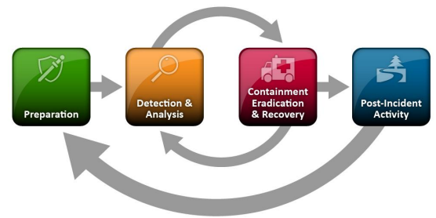

# # Descripción general del proceso de manejo de incidentes

Ahora que estamos familiarizados con la cadena de ciberataque y sus etapas, podemos predecir/anticipar mejor los próximos pasos en un ataque y también sugerir medidas adecuadas contra ellos.

Al igual que la cadena de muerte cibernética, existen diferentes etapas al responder a un incidente, definidas como la `incident handling process`. El `incident handling process` define una capacidad para que las organizaciones preparen, detecten y respondan a eventos maliciosos. Tenga en cuenta que este proceso es adecuado para responder a eventos de seguridad de TI, pero sus etapas no corresponden a las etapas de la cadena de ciberataque de manera uno a uno.

Según lo definido por NIST, el proceso de manejo de incidentes consta de las siguientes cuatro (4) etapas distintas:

Los encargados del manejo de incidentes pasan la mayor parte de su tiempo en las dos primeras etapas, `preparation` y `detection & analysis`. Aquí es donde dedicamos mucho tiempo a mejorarnos y buscar el próximo evento malicioso. Cuando se detecta un evento malicioso, pasamos a la siguiente etapa y respondemos al evento.`(but there should always be resources operating on the first two stages, so that there is no disruption of preparation and detection capabilities)`. Como puedes ver en la imagen, el proceso no es lineal sino cíclico. El punto principal que hay que entender en este momento es que a medida que se descubren nuevas pruebas, los próximos pasos también pueden cambiar. Es vital asegurarse de no omitir pasos en el proceso y de completar un paso antes de pasar al siguiente. Por ejemplo, si descubre diez máquinas infectadas, no debe proceder a contener sólo cinco de ellas y comenzar la erradicación mientras las cinco restantes permanecen en estado infectado. Este enfoque puede resultar ineficaz porque, como mínimo, le estás notificando a un atacante que lo has descubierto y que lo estás persiguiendo, lo que, como puedes imaginar, puede tener consecuencias impredecibles.

Entonces, el manejo de incidentes tiene dos actividades principales, que son `investigating` y `recovering`. La investigación tiene como objetivo:

- Descubra la víctima inicial del 'paciente cero' y cree una línea de tiempo del incidente (en curso si aún está activo)
- Determinar qué herramientas y malware utilizó el adversario.
- Documentar los sistemas comprometidos y lo que ha hecho el adversario.

Después de la investigación, la actividad de recuperación implica la creación e implementación de un plan de recuperación. Cuando se implemente el plan, la empresa debe reanudar sus operaciones comerciales normales, si el incidente causó alguna interrupción.

Cuando un incidente se maneja por completo, se emite un informe que detalla la causa y el costo del incidente. Además, se realizan actividades de “lecciones aprendidas”, entre otras, para entender qué debe hacer la organización para evitar que incidentes de tipo similar vuelvan a ocurrir.

Ahora permítanos guiarlo a través de todas las etapas del`incident handling process`.