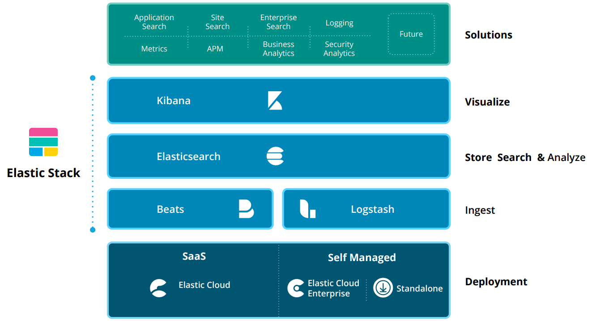
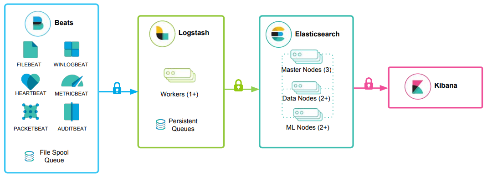
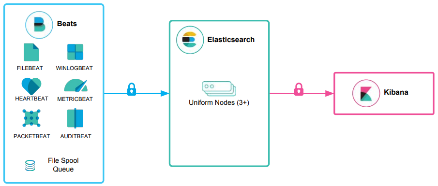
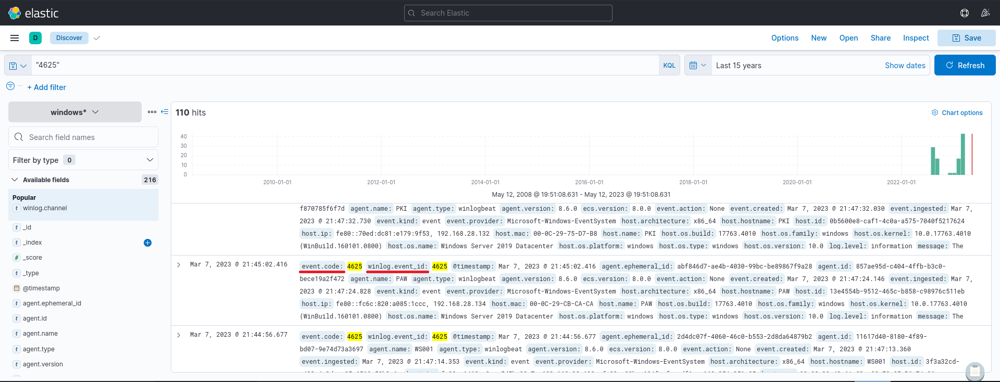
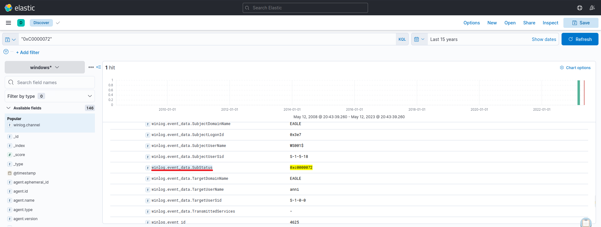

# Introduction To The Elastic Stack

# **¿Qué es la pila elástica?**

La pila Elastic, creada por Elastic, es una colección de código abierto de principalmente tres aplicaciones (Elasticsearch, Logstash y Kibana) que funcionan en armonía para ofrecer a los usuarios capacidades integrales de búsqueda y visualización para el análisis y la exploración en tiempo real de fuentes de archivos de registro.



La arquitectura de alto nivel de la pila Elastic se puede mejorar en entornos que consumen muchos recursos con la adición de Kafka, RabbitMQ y Redis para almacenamiento en búfer y resiliencia, y nginx para seguridad.


Profundicemos en cada componente de la pila Elastic.

`Elasticsearch`es un motor de búsqueda distribuido y basado en JSON, diseñado con API RESTful. Como componente central de la pila Elastic, maneja la indexación, el almacenamiento y las consultas. Elasticsearch permite a los usuarios realizar consultas sofisticadas y realizar operaciones analíticas en los registros de archivos de registro procesados ​​por Logstash.

`Logstash`es responsable de recopilar, transformar y transportar los registros del archivo de registro. Su fortaleza radica en su capacidad para consolidar datos de diversas fuentes y normalizarlos. Logstash opera en tres áreas principales:

1. `Process input`: Logstash ingiere registros de archivos de registro desde ubicaciones remotas y los convierte a un formato que las máquinas puedan entender. Puede recibir registros a través de diferentes [métodos de entrada](https://www.elastic.co/guide/en/logstash/current/input-plugins.html), como leer desde un archivo plano, un socket TCP o directamente desde mensajes de syslog. Después de procesar la entrada, Logstash pasa a la siguiente función.
2. `Transform and enrich log records`: Logstash ofrece numerosas formas de [modificar un registro de registro](https://www.elastic.co/guide/en/logstash/current/filter-plugins.html)El formato e incluso el contenido. Específicamente, los complementos de filtro pueden realizar un procesamiento intermedio en un evento, a menudo en función de una condición predefinida. Una vez que se transforma un registro, Logstash lo procesa aún más.
3. `Send log records to Elasticsearch`: Logstash utiliza [complementos de salida](https://www.elastic.co/guide/en/logstash/current/output-plugins.html) para transmitir registros a Elasticsearch.

`Kibana`Sirve como herramienta de visualización para documentos de Elasticsearch. Los usuarios pueden ver los datos almacenados en Elasticsearch y ejecutar consultas a través de Kibana. Además, Kibana simplifica la comprensión de los resultados de las consultas mediante tablas, gráficos y paneles personalizados.

Nota: `Beats` es un componente adicional de la pila Elastic. Estos remitentes de datos livianos y de un solo propósito están diseñados para instalarse en máquinas remotas para reenviar registros y métricas a Logstash o Elasticsearch directamente. Beats simplifica el proceso de recopilación de datos de diversas fuentes y garantiza que el Elastic Stack reciba la información necesaria para el análisis y la visualización.

`Beats` -> `Logstash` -> `Elasticsearch` -> `Kibana`



`Beats` -> `Elasticsearch` -> `Kibana`



---

# **El Elastic Stack como solución SIEM**

La pila elástica se puede utilizar como una solución de gestión de eventos e información de seguridad (SIEM) para recopilar, almacenar, analizar y visualizar datos relacionados con la seguridad de diversas fuentes.

Para implementar la pila Elastic como una solución SIEM, los datos relacionados con la seguridad de diversas fuentes, como firewalls, IDS/IPS y puntos finales, se deben incorporar en la pila Elastic mediante Logstash. Elasticsearch debe configurarse para almacenar e indexar los datos de seguridad, y Kibana debe usarse para crear paneles y visualizaciones personalizados para proporcionar información sobre eventos relacionados con la seguridad.

Para detectar incidentes relacionados con la seguridad, Elasticsearch se puede utilizar para realizar búsquedas y correlaciones de los datos de seguridad recopilados.

Como analistas del Centro de operaciones de seguridad (SOC), es probable que utilicemos ampliamente Kibana como nuestra interfaz principal cuando trabajamos con la pila Elastic. Por lo tanto, es fundamental dominar sus funcionalidades y características.


Kibana Query Language (KQL) es un lenguaje de consulta potente y fácil de usar diseñado específicamente para buscar y analizar datos en Kibana. Simplifica el proceso de extracción de información de sus datos indexados de Elasticsearch y ofrece un enfoque más intuitivo que Query DSL de Elasticsearch. Exploremos los aspectos técnicos y los componentes clave del lenguaje KQL.

- `Basic Structure`: Las consultas KQL se componen de `field:value` pares, donde el campo representa el atributo de los datos y el valor representa los datos que está buscando. Por ejemplo:

Introducción a la pila elástica

```
event.code:4625

```

La consulta KQL `event.code:4625` filtra datos en Kibana para mostrar eventos que tienen la [Código de evento de Windows 4625](https://www.ultimatewindowssecurity.com/securitylog/encyclopedia/event.aspx?eventid=4625). Este código de evento de Windows está asociado con intentos fallidos de inicio de sesión en un sistema operativo Windows.

Al utilizar esta consulta, los analistas de SOC pueden identificar intentos fallidos de inicio de sesión en máquinas con Windows dentro del índice de Elasticsearch e investigar el origen de los intentos y las posibles amenazas a la seguridad. Este tipo de consulta puede ayudar a identificar ataques de fuerza bruta, adivinación de contraseñas y otras actividades sospechosas relacionadas con intentos de inicio de sesión en sistemas Windows.

Al refinar aún más la consulta con condiciones adicionales, como la dirección IP de origen, el nombre de usuario o el rango de tiempo, los analistas de SOC pueden obtener información más específica e investigar de manera efectiva posibles incidentes de seguridad.

- `Free Text Search`: KQL admite la búsqueda de texto libre, lo que le permite buscar un término específico en varios campos sin especificar un nombre de campo. Por ejemplo:

Introducción a la pila elástica

```
"svc-sql1"

```

Esta consulta devuelve registros que contienen la cadena "svc-sql1" en cualquier campo indexado.

- `Logical Operators`: KQL admite operadores lógicos Y, O y NO para construir consultas más complejas. Los paréntesis se pueden utilizar para agrupar expresiones y controlar el orden de evaluación. Por ejemplo:

Introducción a la pila elástica

```
event.code:4625 AND winlog.event_data.SubStatus:0xC0000072

```

La consulta KQL `event.code:4625 AND winlog.event_data.SubStatus:0xC0000072` filtra datos en Kibana para mostrar eventos que tienen el código de evento de Windows 4625 (intentos fallidos de inicio de sesión) y el valor SubStatus de 0xC0000072.

En Windows, el valor SubStatus indica el motivo de un error de inicio de sesión. Un valor de SubStatus de 0xC0000072 indica que la cuenta está actualmente deshabilitada.

Al utilizar esta consulta, los analistas de SOC pueden identificar intentos fallidos de inicio de sesión en cuentas deshabilitadas. Este comportamiento requiere una mayor investigación, ya que un atacante puede haber identificado de alguna manera las credenciales de la cuenta deshabilitada.

- `Comparison Operators`: KQL admite varios operadores de comparación como `:`, `:>`, `:>=`, `:<`, `:<=`, y`:!`. Estos operadores le permiten definir condiciones precisas para hacer coincidir los valores de los campos. Por ejemplo:

Introducción a la pila elástica

```
event.code:4625 AND winlog.event_data.SubStatus:0xC0000072 AND @timestamp >= "2023-03-03T00:00:00.000Z" AND @timestamp <= "2023-03-06T23:59:59.999Z"

```

Al utilizar esta consulta, los analistas de SOC pueden identificar intentos fallidos de inicio de sesión en cuentas deshabilitadas que tuvieron lugar entre el 3 de marzo de 2023 y el 6 de marzo de 2023.

- `Wildcards and Regular Expressions`: KQL admite comodines y expresiones regulares para buscar patrones en los valores de los campos. Por ejemplo:

Introducción a la pila elástica

```
event.code:4625 AND user.name: admin*

```

La consulta Kibana KQL `event.code:4625 AND user.name: admin*` filtra datos en Kibana para mostrar eventos que tienen el código de evento de Windows 4625 (intentos fallidos de inicio de sesión) y donde el nombre de usuario comienza con "admin", como "admin", "administrator", "admin123", etc.

Esta consulta (si está extendida) puede resultar útil para identificar intentos de inicio de sesión potencialmente maliciosos dirigidos a cuentas de administrador.

---

# **Cómo identificar los datos disponibles**

---

"¿Cómo puedo identificar los campos y valores disponibles?", te preguntarás. Veamos cómo podríamos haber identificado los campos y valores disponibles que usamos en esta sección.

**Ejemplo**: Identifique los intentos fallidos de inicio de sesión en cuentas deshabilitadas que tuvieron lugar entre el 3 de marzo de 2023 y el 6 de marzo de 2023 KQL:

Introducción a la pila elástica

```
event.code:4625 AND winlog.event_data.SubStatus:0xC0000072 AND @timestamp >= "2023-03-03T00:00:00.000Z" AND @timestamp <= "2023-03-06T23:59:59.999Z"

```

**Enfoque 1 de identificación de datos y campos: aprovechar la búsqueda de texto libre de KQL**

Usando el [Descubrir](https://www.elastic.co/guide/en/kibana/current/discover.html) característica, podemos explorar y examinar sin esfuerzo los datos disponibles, así como obtener información sobre la arquitectura de los campos disponibles, antes de comenzar a construir consultas KQL.

- Al utilizar un motor de búsqueda de los registros de eventos de Windows asociados con intentos fallidos de inicio de sesión, encontraremos recursos como[https://www.ultimatewindowssecurity.com/securitylog/encyclopedia/event.aspx?eventid=4625](https://www.ultimatewindowssecurity.com/securitylog/encyclopedia/event.aspx?eventid=4625)
- Usando la búsqueda de texto libre de KQL podemos buscar `"4625"`. En los registros devueltos notamos`event.code:4625`, `winlog.event_id:4625`, y`@timestamp`
    - `event.code`está relacionado con el [Esquema común elástico (ECS)](https://www.elastic.co/guide/en/ecs/current/ecs-event.html#field-event-code)
    - `winlog.event_id` está relacionado con [Winlogbeat](https://www.elastic.co/guide/en/beats/winlogbeat/current/exported-fields-winlog.html)
    - Si la organización para la que trabajamos utiliza la pila Elastic en todas las oficinas y departamentos de seguridad, es preferible que utilicemos los campos ECS en nuestras consultas por los motivos que cubriremos al final de esta sección.
    - `@timestamp`normalmente contiene el tiempo extraído del evento original y es[diferente de`event.created`](https://discuss.elastic.co/t/winlogbeat-timestamp-different-with-event-create-time/278160)
        
        
        
- Cuando se trata de cuentas deshabilitadas, el recurso antes mencionado nos informa que un valor de SubStatus de 0xC0000072 dentro de un registro de eventos de Windows 4625 indica que la cuenta está actualmente deshabilitada. Nuevamente usando la búsqueda de texto libre de KQL podemos buscar`"0xC0000072"`. Al expandir el registro devuelto notamos`winlog.event_data.SubStatus`que esta relacionado con [Winlogbeat](https://www.elastic.co/guide/en/beats/winlogbeat/current/exported-fields-winlog.html)
    
    
    

**Enfoque 2 de identificación de datos y campos: aprovechar la documentación de Elastic**

Podría ser una buena idea familiarizarnos primero con la documentación completa de Elastic antes de profundizar en la función "Descubrir". La documentación proporciona una gran cantidad de información sobre los diferentes tipos de campos que podemos encontrar. Algunos buenos recursos para empezar son:

- [Esquema común elástico (ECS)](https://www.elastic.co/guide/en/ecs/current/ecs-reference.html)
- [Campos de eventos de Elastic Common Schema (ECS)](https://www.elastic.co/guide/en/ecs/current/ecs-event.html)
- [campos de winlogbeat](https://www.elastic.co/guide/en/beats/winlogbeat/current/exported-fields-winlog.html)
- [Campos de Winlogbeat ECS](https://www.elastic.co/guide/en/beats/winlogbeat/current/exported-fields-ecs.html)
- [Campos del módulo de seguridad de Winlogbeat](https://www.elastic.co/guide/en/beats/winlogbeat/master/exported-fields-security.html)
- [Campos de filebeat](https://www.elastic.co/guide/en/beats/filebeat/current/exported-fields.html)
- [Campos ECS de Filebeat](https://www.elastic.co/guide/en/beats/filebeat/current/exported-fields-ecs.html)

# **El esquema común elástico (ECS)**

---

Elastic Common Schema (ECS) es un vocabulario compartido y extensible para eventos y registros en el Elastic Stack, que garantiza formatos de campo consistentes en diferentes fuentes de datos. Cuando se trata de búsquedas en Kibana Query Language (KQL) dentro del Elastic Stack, el uso de campos ECS presenta varias ventajas clave:

- `Unified Data View`: ECS aplica un enfoque estructurado y coherente a los datos, lo que permite vistas unificadas en múltiples fuentes de datos. Por ejemplo, los datos que se originan en registros de Windows, tráfico de red, eventos de endpoints o fuentes de datos basadas en la nube se pueden buscar y correlacionar utilizando los mismos nombres de campo.
- `Improved Search Efficiency`: Al estandarizar los nombres de los campos en diferentes tipos de datos, ECS simplifica el proceso de escritura de consultas en KQL. Esto significa que los analistas pueden crear consultas de manera eficiente sin necesidad de recordar nombres de campos específicos para cada fuente de datos.
- `Enhanced Correlation`: ECS permite una correlación más sencilla de eventos entre diferentes fuentes, lo cual es fundamental en las investigaciones de ciberseguridad. Por ejemplo, puede correlacionar una dirección IP involucrada en un incidente de seguridad con registros de tráfico de red, registros de firewall y datos de terminales para obtener una comprensión más completa del incidente.
- `Better Visualizations`: Las convenciones de nomenclatura de campos coherentes mejoran la eficacia de las visualizaciones en Kibana. Como todas las fuentes de datos siguen el mismo esquema, la creación de paneles y visualizaciones se vuelve más fácil e intuitiva. Esto puede ayudar a detectar tendencias, identificar anomalías y visualizar incidentes de seguridad.
- `Interoperability with Elastic Solutions`: El uso de campos ECS garantiza la compatibilidad total con funciones y soluciones avanzadas de Elastic Stack, como Elastic Security, Elastic Observability y Elastic Machine Learning. Esto permite la búsqueda avanzada de amenazas, la detección de anomalías y la supervisión del rendimiento.
- `Future-proofing`: Dado que ECS es el esquema fundamental en todo el Elastic Stack, la adopción de ECS garantiza la compatibilidad futura con mejoras y nuevas características que se introducen en el ecosistema Elastic.

Espere entre 3 y 5 minutos para que Kibana esté disponible después de generar el objetivo de las preguntas a continuación.