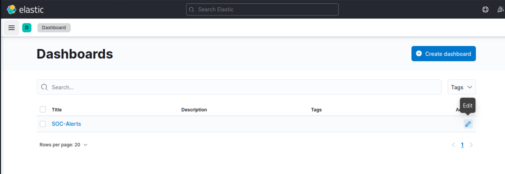
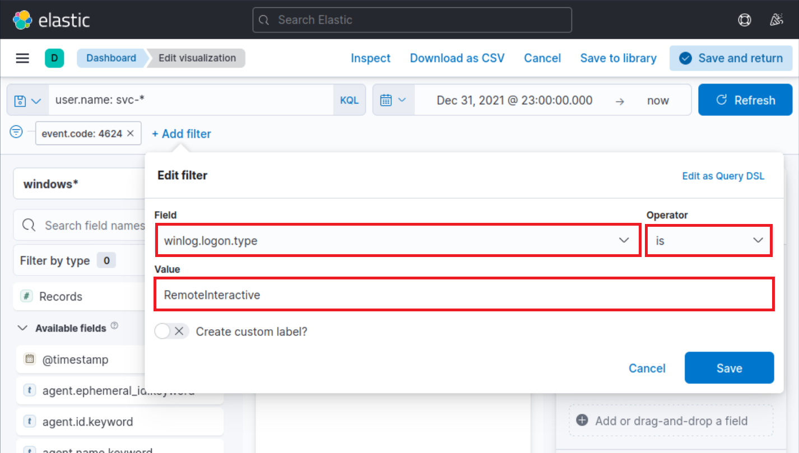
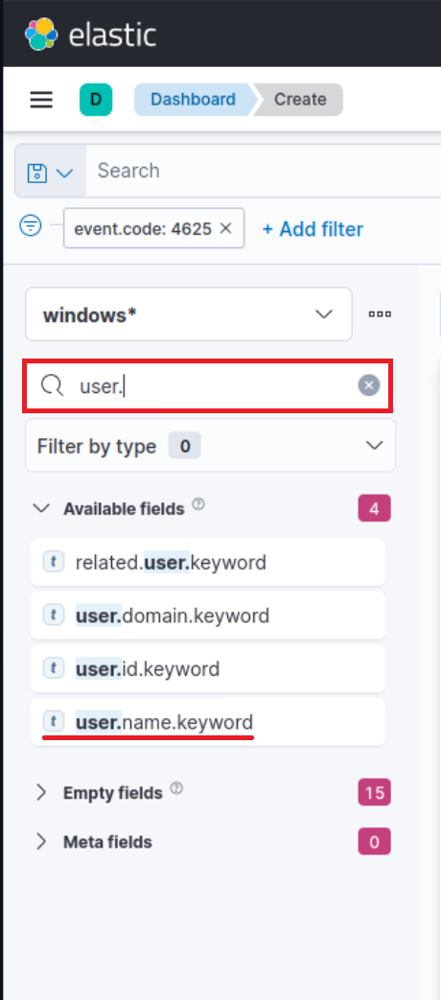
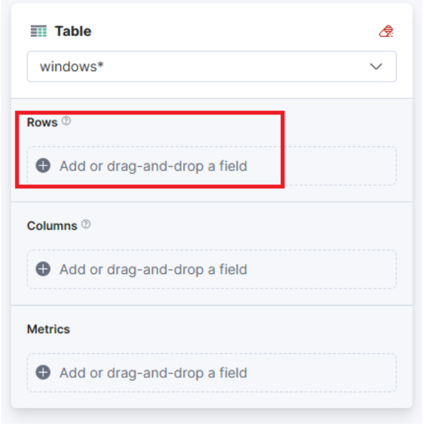
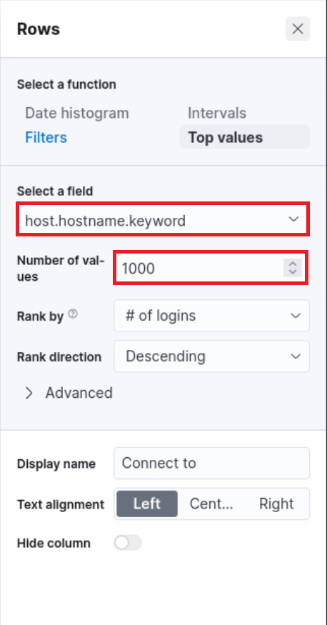
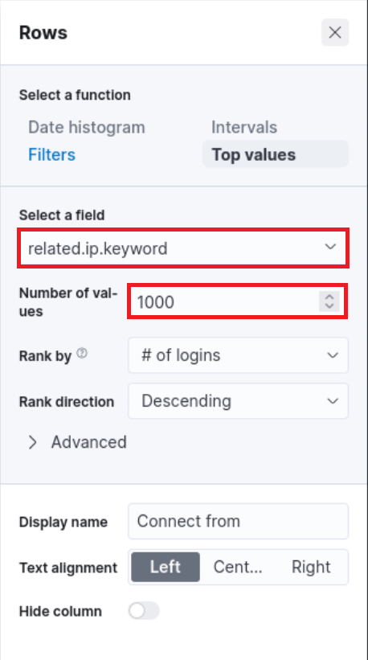
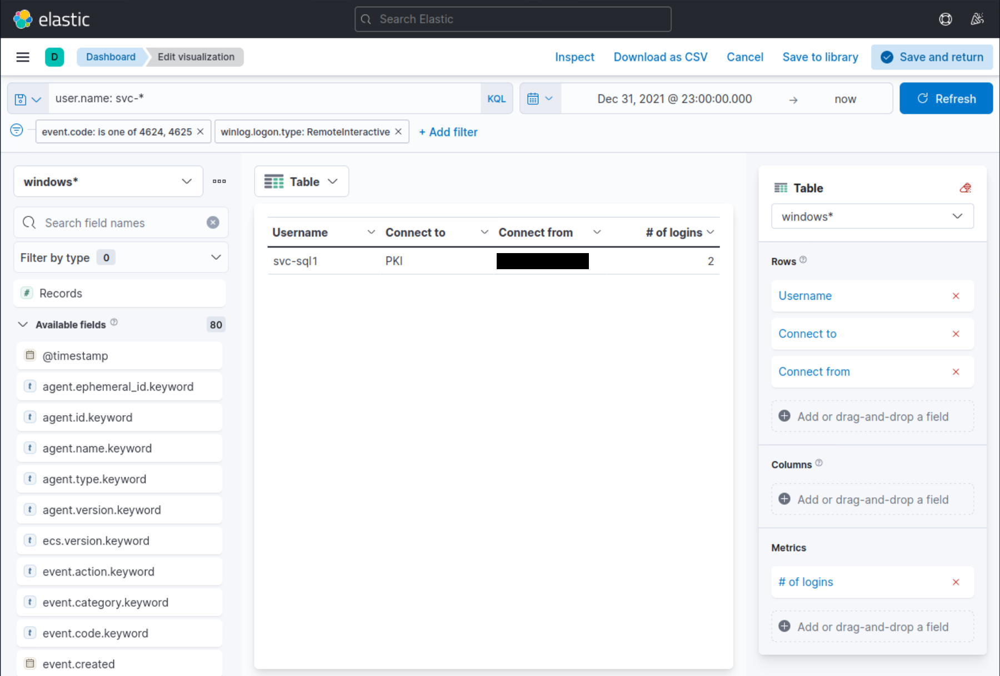

# SIEM Visualization Example 3: Successful RDP Logon Related To Service Accounts

En este ejemplo de visualización SIEM, nuestro objetivo es crear una visualización para monitorear los inicios de sesión RDP exitosos específicamente relacionados con cuentas de servicio. Las credenciales de la cuenta de servicio nunca se utilizan para inicios de sesión de RDP en entornos corporativos o del mundo real. El departamento de Operaciones de TI nos ha informado que todas las cuentas de servicio en el entorno comienzan con `svc-`.

La motivación para esta visualización surge del hecho de que las cuentas de servicio suelen poseer privilegios excepcionalmente altos. Necesitamos vigilar de cerca cómo se utilizan las cuentas de servicio.

Nuestra visualización se basará en el siguiente registro de eventos de Windows.

- [4624: Se inició sesión correctamente en una cuenta](https://www.ultimatewindowssecurity.com/securitylog/encyclopedia/event.aspx?eventid=4624)

Navegue hasta el final de esta sección y haga clic en `Click here to spawn the target system!`.

Navegar a `http://[Target IP]:5601`, haga clic en el botón de navegación lateral y haga clic en "Panel de control".

Debe quedar visible un tablero precocido. Hagamos clic en el icono "lápiz"/editar.



Ahora, para iniciar la creación de nuestra primera visualización, simplemente debemos hacer clic en el botón "Crear visualización".

Al iniciar la creación de nuestra primera visualización, aparecerá la siguiente nueva ventana con varias opciones y configuraciones.


Hay cinco cosas que debemos notar en esta ventana:

1. Una opción de filtro que nos permite filtrar los datos antes de crear un gráfico. En este caso, nuestro objetivo es mostrar inicios de sesión RDP exitosos específicamente relacionados con cuentas de servicio. Podemos usar un filtro para considerar solo los ID de eventos que coincidan`4624 – An account was successfully logged on`. Sin embargo, en este caso también debemos tener en cuenta el tipo de inicio de sesión, que debe ser`RemoteInteractive` (`winlog.logon.type`campo). Las siguientes imágenes demuestran cómo podemos especificar dichos filtros.
    
    
    
    
    
2. Este campo indica el conjunto de datos (índice) que vamos a utilizar. Es común que los datos de varias fuentes de infraestructura se separen en diferentes índices, como red, Windows, Linux, etc. En este ejemplo en particular, especificaremos`windows*`en el "Patrón de índice".
3. Esta barra de búsqueda nos brinda la capacidad de verificar dos veces la existencia de un campo específico dentro de nuestro conjunto de datos, lo que sirve como otra forma de asegurarnos de que estamos viendo los datos correctos. Estamos interesados ​​en el`user.name.keyword`campo. Podemos usar la barra de búsqueda para realizar una búsqueda rápidamente y verificar si este campo está presente y descubierto dentro de nuestro conjunto de datos seleccionado. Esto nos permite confirmar que estamos accediendo al campo deseado y trabajando con datos precisos.
    
    
    
4. Por último, este menú desplegable nos permite seleccionar el tipo de visualización que queremos crear. La opción predeterminada que se muestra en la imagen anterior es "Barra vertical apilada". Si hacemos clic en ese botón, se revelarán opciones adicionales disponibles (imagen redactada porque no todas las opciones caben en la pantalla). De esta lista ampliada podremos elegir el tipo de visualización deseada que mejor se adapte a nuestros requerimientos y necesidades de presentación de datos.
    
    
    

---

Para esta visualización, seleccionemos la opción "Tabla". Luego de seleccionar la “Tabla”, podemos proceder a hacer clic en la opción “Filas”. Esto nos permitirá elegir los elementos de datos específicos que queremos incluir en la vista de tabla.



Configuremos los ajustes de "Filas" de la siguiente manera.


Avanzando, cerremos la ventana "Filas" y procedamos a ingresar a la configuración de "Métricas".


En la ventana "Métricas", seleccionemos "contar" como la métrica deseada.


Una última adición a la tabla es incluir dos configuraciones de "Filas" más para mostrar la máquina donde ocurrió el intento exitoso de inicio de sesión RDP y la máquina que inició el intento exitoso de inicio de sesión RDP. Para ello seleccionaremos el`host.hostname.keyword`campo que representa la computadora que informa el intento exitoso de inicio de sesión RDP y el`related.ip.keyword`campo que representa la IP de la computadora que inicia el intento exitoso de inicio de sesión RDP. Esto nos permitirá mostrar las máquinas involucradas junto con el recuento de intentos de inicio de sesión exitosos, como se muestra en la imagen.





Como se mencionó, queremos monitorear los inicios de sesión RDP exitosos específicamente relacionados con las cuentas de servicio, sabiendo con certeza que todas las cuentas de servicio del entorno comienzan con`svc-`. Entonces, para concluir nuestra visualización, debemos especificar la siguiente consulta KQL.

Ejemplo 3 de visualización SIEM: inicio de sesión RDP exitoso relacionado con cuentas de servicio

```
user.name: svc-*

```

**Nota**: Como puedes ver no usamos el `.keyword` campo en consultas KQL.



Ahora podemos ver cuatro columnas en la tabla, que contienen la siguiente información:

1. La cuenta de servicio cuyas credenciales generaron el evento de intento de inicio de sesión RDP exitoso.
2. La máquina en la que se produjo el intento de inicio de sesión.
3. La IP de la máquina que inició el intento de inicio de sesión.
4. La cantidad de veces que ocurrió el evento (según el período de tiempo especificado o el conjunto de datos completo, según la configuración).

Finalmente, haz clic en "Guardar y regresar", y observarás que la nueva visualización se agrega al tablero.