# SIEM Visualization Example 4: Users Added Or Removed From A Local Group (Within A Specific Timeframe)

En este ejemplo de visualización SIEM, nuestro objetivo es crear una visualización para monitorear las incorporaciones o eliminaciones de usuarios del grupo local "Administradores" desde el 5 de marzo de 2023 hasta la fecha.

Nuestra visualización se basará en los siguientes registros de eventos de Windows.

- [4732: Se agregó un miembro a un grupo local con seguridad habilitada](https://www.ultimatewindowssecurity.com/securitylog/encyclopedia/event.aspx?eventid=4732)
- [4733: Un miembro fue eliminado de un grupo local con seguridad habilitada](https://www.ultimatewindowssecurity.com/securitylog/encyclopedia/event.aspx?eventid=4733)

Navegue hasta el final de esta sección y haga clic en `Click here to spawn the target system!`.

Navegar a `http://[Target IP]:5601`, haga clic en el botón de navegación lateral y haga clic en "Panel de control".

Debe quedar visible un tablero precocido. Hagamos clic en el icono "lápiz"/editar.

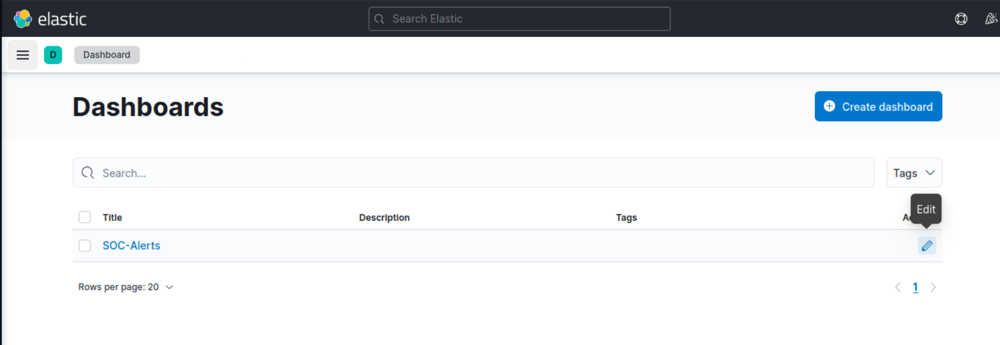

Ahora, para iniciar la creación de nuestra primera visualización, simplemente debemos hacer clic en el botón "Crear visualización".

Al iniciar la creación de nuestra primera visualización, aparecerá la siguiente nueva ventana con varias opciones y configuraciones.

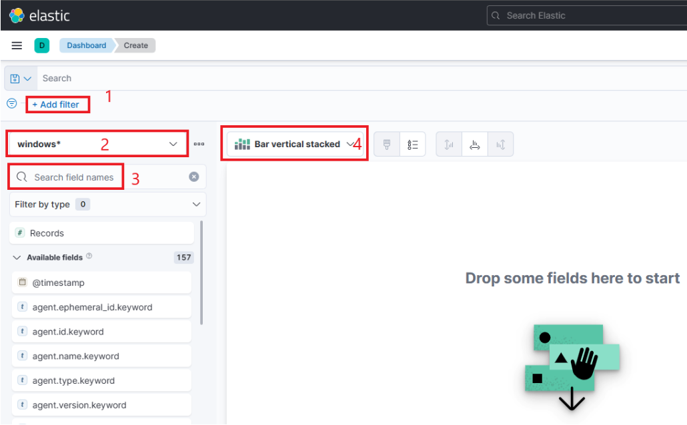

Hay cinco cosas que debemos notar en esta ventana:

1. Una opción de filtro que nos permite filtrar los datos antes de crear un gráfico. En este caso, nuestro objetivo es mostrar las incorporaciones o eliminaciones de usuarios del grupo local "Administradores". Podemos usar un filtro para considerar solo los ID de eventos que coincidan`4732 – A member was added to a security-enabled local group`y`4733 – A member was removed from a security-enabled local group`. También podemos usar un filtro para considerar solo los eventos 4732 y 4733 donde el grupo local es el de "Administradores".
    
    
    
2. Este campo indica el conjunto de datos (índice) que vamos a utilizar. Es común que los datos de varias fuentes de infraestructura se separen en diferentes índices, como red, Windows, Linux, etc. En este ejemplo en particular, especificaremos`windows*`en el "Patrón de índice".
3. Esta barra de búsqueda nos brinda la capacidad de verificar dos veces la existencia de un campo específico dentro de nuestro conjunto de datos, lo que sirve como otra forma de asegurarnos de que estamos viendo los datos correctos. Estamos interesados ​​en el `user.name.keyword` campo. Podemos usar la barra de búsqueda para realizar una búsqueda rápidamente y verificar si este campo está presente y descubierto dentro de nuestro conjunto de datos seleccionado. Esto nos permite confirmar que estamos accediendo al campo deseado y trabajando con datos precisos.
    
    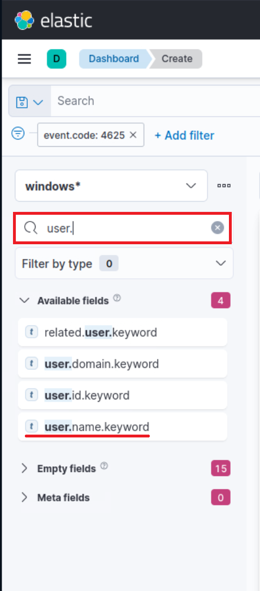
    
4. Por último, este menú desplegable nos permite seleccionar el tipo de visualización que queremos crear. La opción predeterminada que se muestra en la imagen anterior es "Barra vertical apilada". Si hacemos clic en ese botón, se revelarán opciones adicionales disponibles (imagen redactada porque no todas las opciones caben en la pantalla). De esta lista ampliada podremos elegir el tipo de visualización deseada que mejor se adapte a nuestros requerimientos y necesidades de presentación de datos.
    
    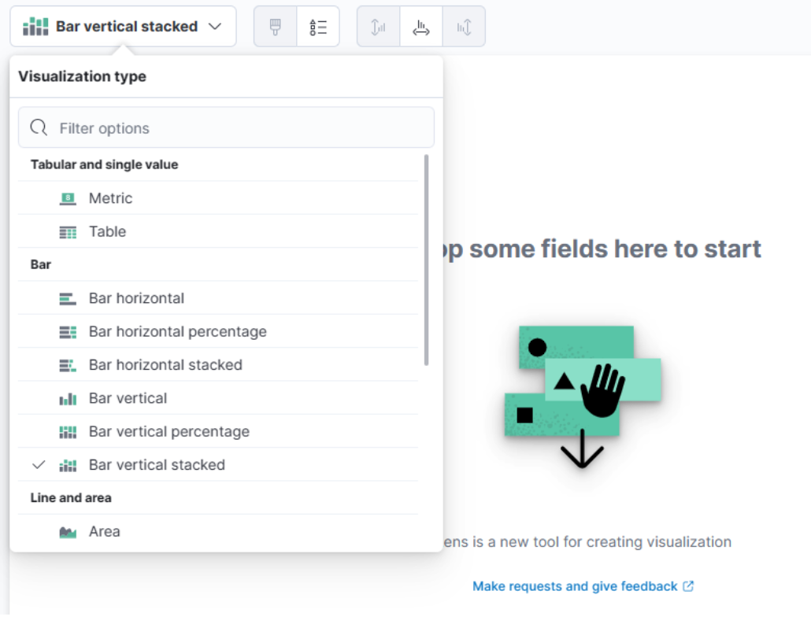
    

---

Para esta visualización, seleccionemos la opción "Tabla". Luego de seleccionar la “Tabla”, podemos proceder a hacer clic en la opción “Filas”. Esto nos permitirá elegir los elementos de datos específicos que queremos incluir en la vista de tabla.

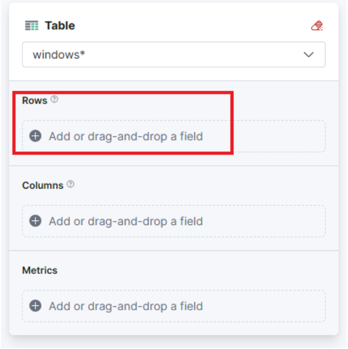

Configuremos los ajustes de "Filas" de la siguiente manera.

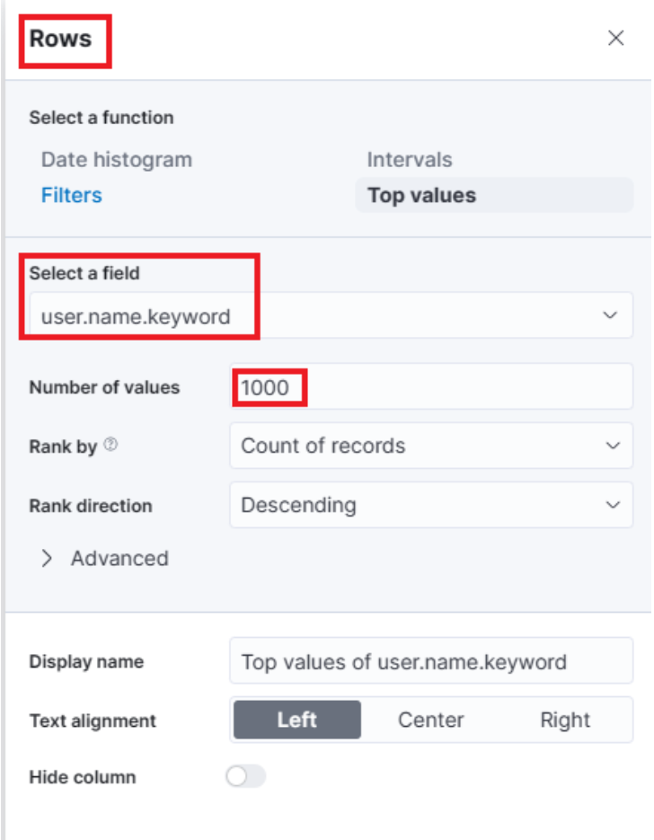

Avanzando, cerremos la ventana "Filas" y procedamos a ingresar a la configuración de "Métricas".

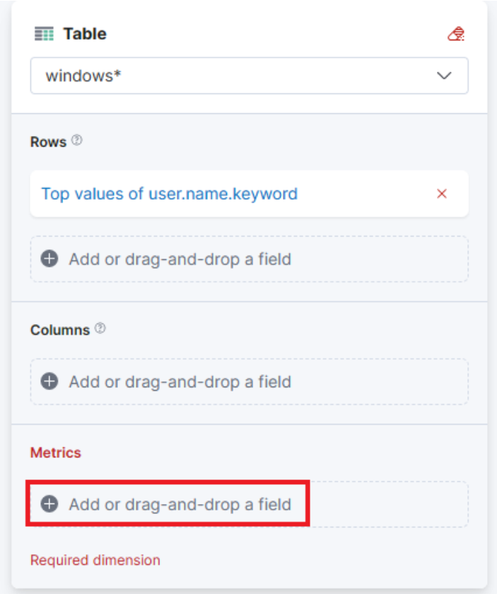

En la ventana "Métricas", seleccionemos "contar" como la métrica deseada.

Una última adición a la tabla es incluir más configuraciones de "Filas" para mejorar nuestra comprensión.

- ¿Qué usuario fue agregado o eliminado del grupo? (`winlog.event_data.MemberSid.keyword` campo)
- ¿A qué grupo se le realizó la adición o la eliminación? (verificando que sea el de "Administradores") (`group.name.keyword`campo)
- ¿El usuario fue agregado o eliminado del grupo? (`event.action.keyword` campo)
- ¿En qué máquina ocurrió la acción? (`host.name.keyword` campo)
    
    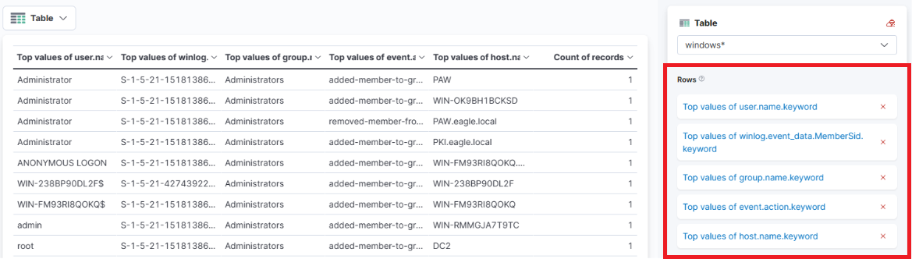
    

Haga clic en "Guardar y regresar" y observará que la nueva visualización se agrega al panel.

Como se mencionó, queremos monitorear las adiciones o eliminaciones de usuarios del grupo local "Administradores". *dentro de un plazo específico (5 de marzo de 2023 a la fecha)*.

Podemos limitar el alcance de nuestra visualización de la siguiente manera.

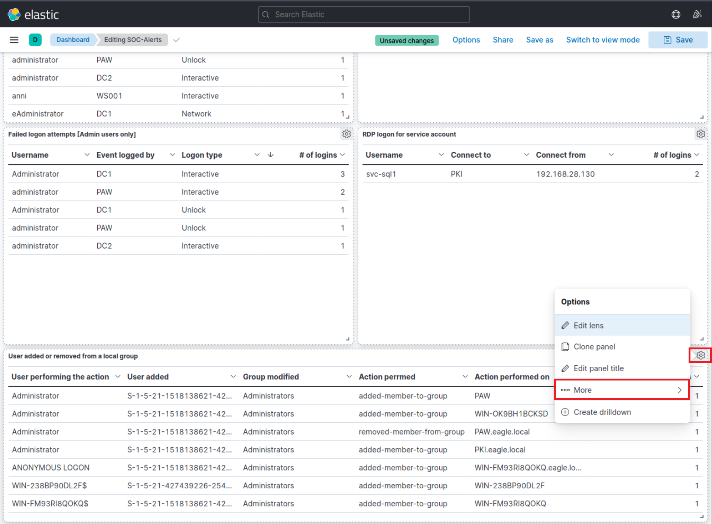

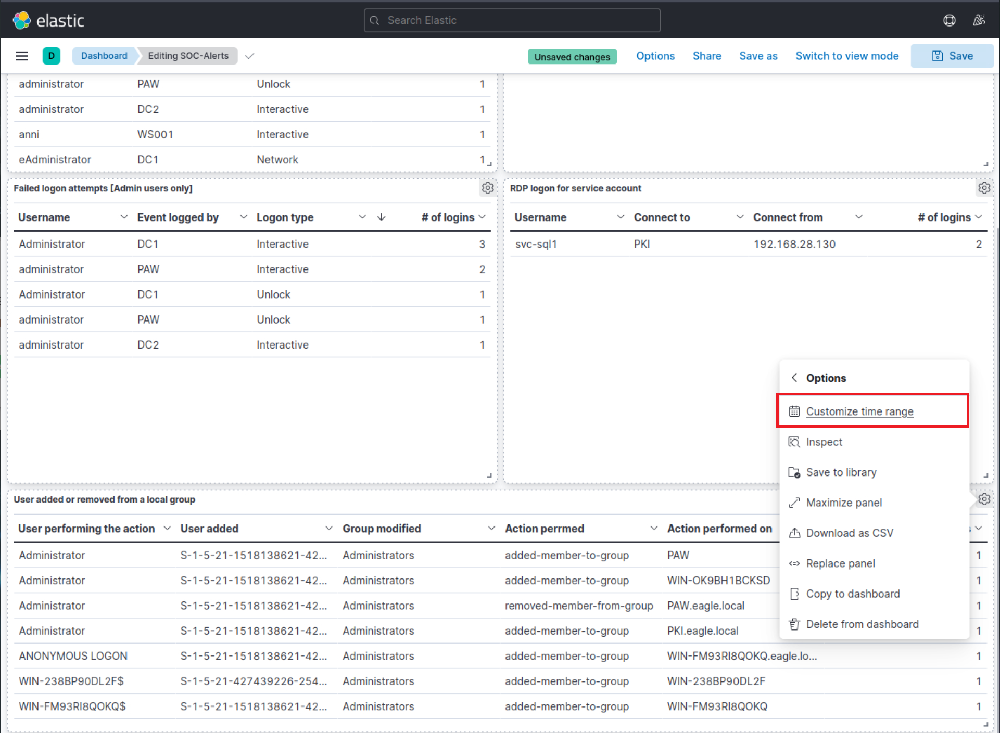

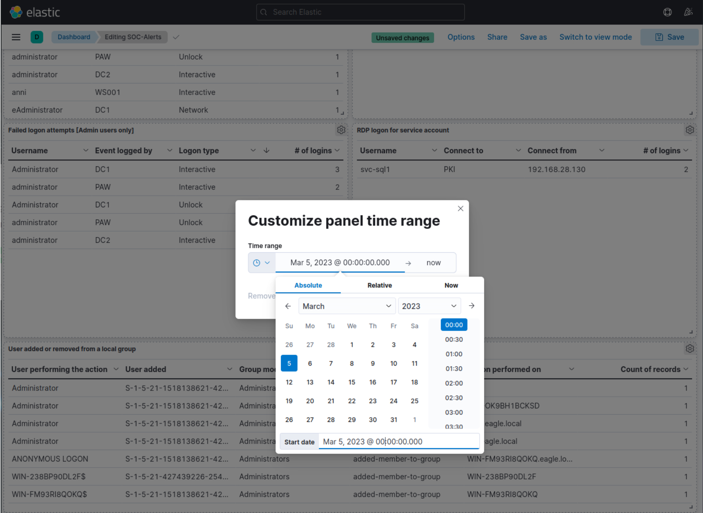

Finalmente, hagamos clic en el botón "Guardar" para que todas nuestras ediciones persistan.